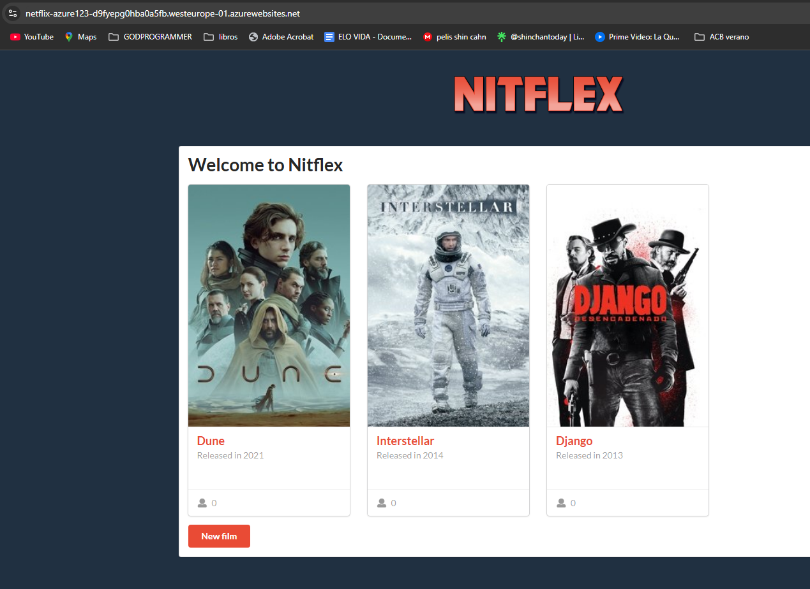
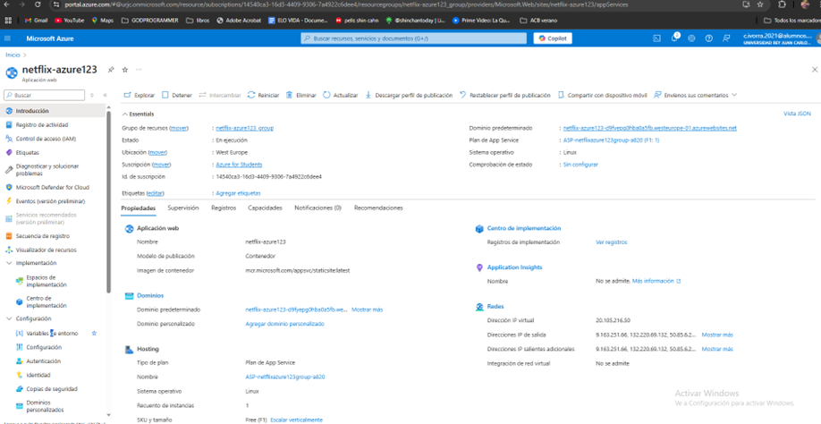
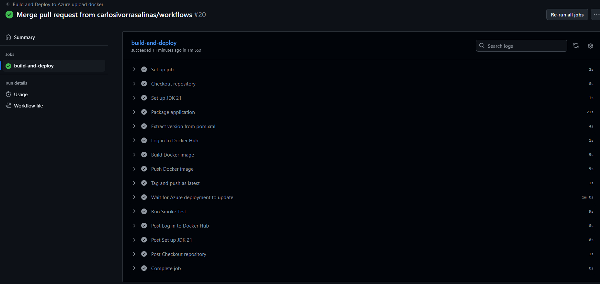

# AIS-Practicas-4y5-2025

Autor(es): Carlos Ivorra Salinas

[Repositorio](https://github.com/carlosivorrasalinas/ais-c.ivorra-2025-ghf)

[Aplicación Azure](netflix-azure123-d9fyepg0hba0a5fb.westeurope-01.azurewebsites.net)

## Desarrollo con GitHubFlow

Una vez creados los workflows y funcionando estos, pasamos a crear la nueva funcionalidad utilizando GithubFlow:

Clonamos el repositorio
> Deberás cambiar esta URL por la de tu repo

```
$ git clone git@github.com:URJC-AIS/AIS-Practica-4y5-2025-template.git
```


## Capturas del despliegue en Azure

### Página principal de Nitflex


### Enlace al sitio en Azure


### GitHub Action creando la web en Azure


### 1. Desarrollo de la funcionalidad 'Validación del año de estreno'

...