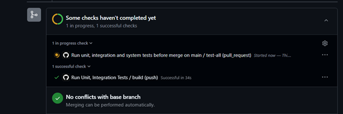
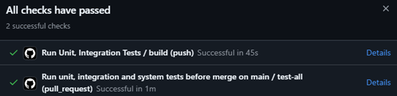
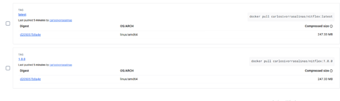
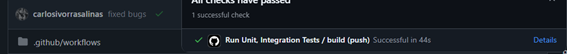
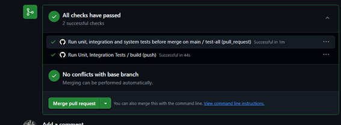
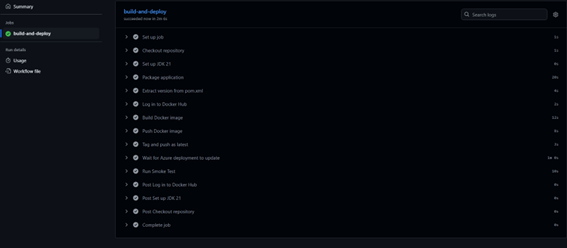

# AIS-Practicas-4y5-2025

Autor(es): Carlos Ivorra Salinas

[Repositorio](https://github.com/carlosivorrasalinas/ais-c.ivorra-2025-ghf)

[Aplicación Azure](netflix-azure123-d9fyepg0hba0a5fb.westeurope-01.azurewebsites.net)

## Desarrollo con GitHubFlow

Una vez creados los workflows y funcionando estos, pasamos a crear la nueva funcionalidad utilizando GitHubFlow:


### 1. Desarrollo del fix 'Cancel Button'

Nos aseguramos de estar en la rama `main` y de tener los últimos cambios:

```bash
git checkout main
git pull origin main
```

Creamos una nueva rama para el fix del botón de cancelar:

```bash
git checkout -b fix-cancel-button
```

Publicamos la rama en el repositorio remoto:

```bash
git push -u origin fix-cancel-button
```

Investigamos el origen del error en el formulario de películas (*film form*) y localizamos el problema en el archivo correspondiente a `film`.

Vemos que el botón “Cancel” está programado con un `onclick` que redirige a `/films/{{film.id}}`, lo cual no es correcto para la creación de una película nueva.

Sustituimos este comportamiento por el siguiente código HTML:

```html
<button type="button" class="ui button" onclick="window.history.back();">Cancel</button>
```

Este botón envía al usuario a la página anterior utilizando el historial del navegador.

Realizamos el commit de los cambios:

```bash
git add src/main/resources/templates/filmForm.html
git commit -m "Fix: botón Cancel redirige correctamente a /films"
```

Al hacer `git push` se nos notifica que no hay rama upstream. Entonces ejecutamos:

```bash
git push --set-upstream origin fix-cancel-button
```

Después, creamos un test de Selenium para verificar el correcto funcionamiento del botón y lo probamos localmente.

Una vez que el test pasa correctamente en local, hacemos el commit de los cambios y creamos un *pull request* para fusionar con la rama `main`. Nos aseguramos de que la base del *pull request* sea `main`.

Al crear el *pull request*, los workflows de GitHub Actions se ejecutan automáticamente.

### Captura de error en test Selenium


Uno de los tests falla, por lo que investigamos y corregimos el bug detectado.

### 3. Merge del Pull Request y creación de imagen Docker

Una vez corregido el error y verificado que todos los tests pasan correctamente:



Procedemos a hacer el *merge* del *pull request* hacia la rama `main`.

Al realizar el *merge*, se inicia automáticamente el **Workflow 3**, encargado de crear la imagen Docker de la aplicación.

¡La imagen Docker se ha creado correctamente!

- Última versión: [nitflex:latest](https://hub.docker.com/r/carlosivorrasalinas/nitflex:latest)
- Versión etiquetada: [nitflex:1.0.0](https://hub.docker.com/r/carlosivorrasalinas/nitflex:1.0.0)

> Nota: al leer el enunciado me di cuenta de que debía haber cambiado la versión para esta imagen, pero asumí que al ser la primera versión era aceptable mantener `latest`.

### 4. Funcionalidad 1: Validación del año de estreno



Con la creación de la imagen Docker finalizada, pasamos al desarrollo de la primera funcionalidad.

#### Descripción de la funcionalidad

Cuando un usuario cree una película con un año no válido (se considerará un año no válido cualquier año anterior a 1895), se notificará al usuario del error y no se creará la película. Esta funcionalidad incluye la creación de dos tests:

- Un test **unitario**
- Un test de **sistema con Selenium**

Al finalizar la implementación y antes de hacer *merge*, se actualizará la versión en el `pom.xml`.

#### Creación de la rama de funcionalidad

Creamos y publicamos una nueva rama para trabajar la funcionalidad:

```bash
git checkout -b feature/funcionalidad1
git push -u origin feature/funcionalidad1
```

#### Implementación de la validación

Editamos el controlador `FilmWebController`, específicamente dentro del manejador:

```java
@PostMapping("/films/new")
```

Añadimos la siguiente condición para validar el año:

```java
if (film.releaseYear() < 1895) {
    model.addAttribute("error", true);
    model.addAttribute("errors", List.of("El año debe ser 1895 o posterior."));
    model.addAttribute("action", "/films/new");  // Añadir esta línea
    model.addAttribute("film", film);            // Para repoblar el formulario
    return "filmForm";
}
```

Comprobamos localmente que la validación funciona correctamente y hacemos el commit inicial usando GitHub Desktop.

#### Creación de los tests

Creamos los dos tests requeridos:

- Un test unitario que verifica la lógica de validación del año.
- Un test Selenium que comprueba que el error se muestra correctamente al usuario en el formulario.

Arreglamos algunos bugs detectados durante el desarrollo y hacemos commit.



#### Merge a la rama `main`

Una vez que ambos tests —el unitario y el de Selenium— pasan correctamente, procedemos a hacer el merge del *pull request* desde `feature/funcionalidad1` a `main`.



### 5. Confirmación del Merge y nueva imagen Docker

Confirmamos el *merge* de la rama `feature/funcionalidad1` a `main` y esperamos a que se ejecute el Workflow que genera la nueva imagen Docker.



La imagen Docker se ha generado correctamente:

- Versión 1.1.0: [carlosivorrasalinas/nitflex:1.1.0](https://hub.docker.com/r/carlosivorrasalinas/nitflex:1.1.0)
